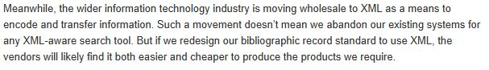
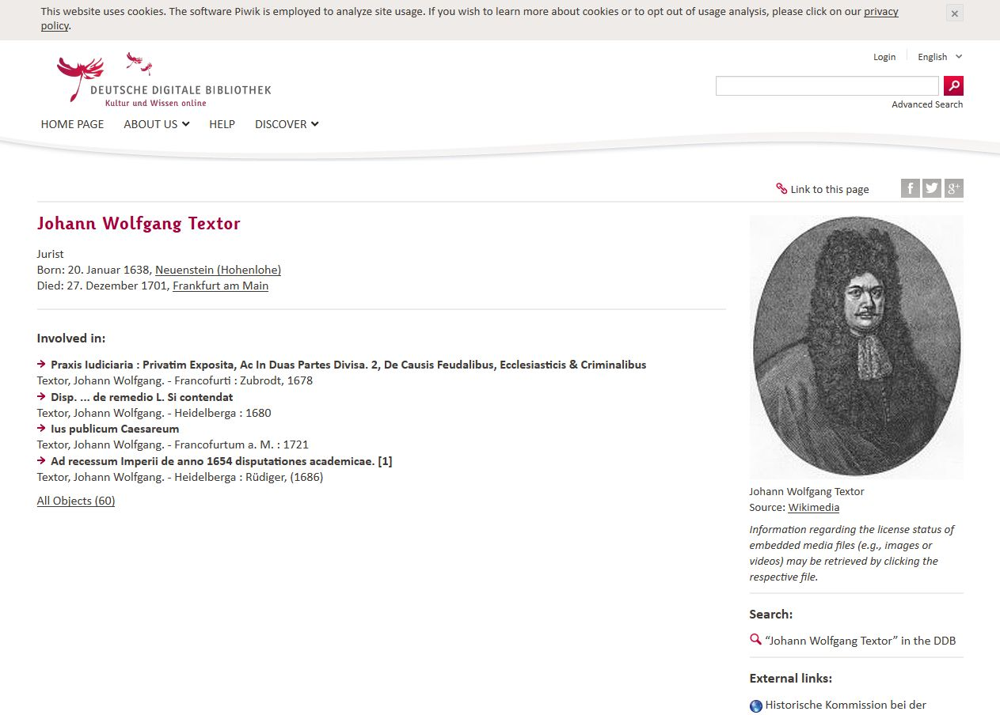

Ok, but what does linked data offer library patrons?
========================================================

Adam Chandler  
Cornell University  
@alc28

<small>Electronic Resources & Libraries 2015  
Austin, Texas</small>  

Outline
========================================================
incremental: true

- Frame my talk
- Examples of linked data-based user interfaces
- Discussion

Argument for linked data: Carrier for library metadata, replacement for MARC
========================================================

 

BIBFRAME
========================================================

 

"MARC must die"
========================================================
incremental: true
 
  

========================================================

Argument for linked data: Mechanism to improve library search engine optimization (SEO)
========================================================

<small>Zepheira (Eric Miller) and LibHub</small>

Libhub "pledge"
========================================================

Argument for linked data: data model for improved library services
========================================================
incremental: true

My litmus test:  
 
**functional prototype intended for library patrons**

- ISI Web of Science
- Library and Information Science Abstracts
- Google Scholar
- Code4Lib community listserv
- Colleagues

GeoBlacklight
========================================================

url: http://journal.code4lib.org/articles/9710

Deutsche Digitale Bibliothek (Europeana data model)
========================================================

<small>https://www.deutsche-digitale-bibliothek.de/entity/10063480X?reqType=ajax&offset=0&query=neuenstein&facetValues[]=affiliate_fct_role%3DHohenlohe-Weikersheim%2C+Georg+Friedrich+von&rows=20&viewType=list&firstHit=MJKEUBEVVJJ3NHLI62BII5KWD5EG4IPU&lastHit=lasthit</small>

http://library.ucsd.edu/dc/
========================================================

Colorado College 
========================================================

http://www.bing.com/search?q=Jeremy+Nelson%2C+Colorado+College+BIBFRAME+catalog&pc=MOZI&form=MOZSBR

https://github.com/jermnelson/BIBFRAME-Datastore

https://github.com/jermnelson/catalog-pull-platform

https://github.com/jermnelson/semantic-server

http://intro2libsys.info/catalog-pull-platform

http://intro2libsys.info/cc-big-idea-pitch

http://catalog.coloradocollege.edu/Work/53029d6c650b8c11646d9b08#

VIVO at Cornell
========================================================

VIVO at Cornell
========================================================

VIVO institutions
========================================================

Stanford annotations experiment
========================================================

<small>http://www.slideshare.net/azaroth42/annotations-as-linked-data-with-fedora4-and-triannon</small>

Stanford annotations experiment
========================================================

Stanford annotations experiment
========================================================

http://colonialarchitecture.eu/node/15
========================================================

http://oregondigital.org/sets/building-or/oregondigital:df66vh18m
========================================================

http://datos.bne.es
========================================================

http://civilwaronthewesternborder.org/content/relationship-viewer
========================================================

https://linkedjazz.org/
========================================================

http://socialarchive.iath.virginia.edu/xtf/search
========================================================

Observations about the examples
========================================================

- Literature is littered with "hello world" what is linked data articles
- Linked data in libraries research excludes licensed eresource management
- Linked data research appears to be segregated from user-centered design trend in libraries... following instead the outdated "waterfall" model of softare development

Google Knowledge Graph
========================================================

Google builds its knowledge graph from the most popular searches! 

Part 3. Discussion
========================================================
   
Adam Chandler   
@alc28  

link to slides

========================================================
      
# For more details on authoring R presentations click the Help button on the toolbar.

Two-Column Slide
====================================
transition: rotate
First column

## one

***
Second column

## two

http://linkeddata.edu
========================================================
incremental: true

***

Second column

- one
- two
- three

========================================================

some text
